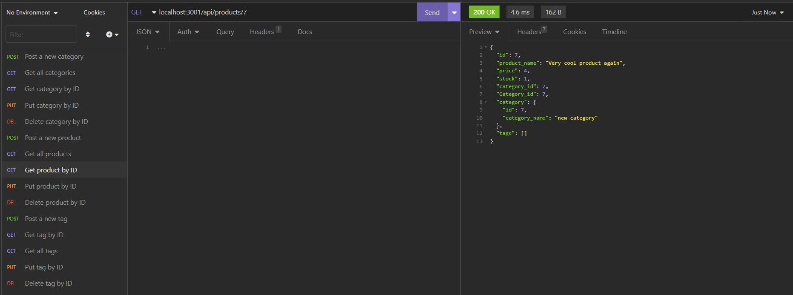

# E-commerce Back End Starter Code

## Description

Bootcamp: Module 13 Challenge  
Object-Relational Mapping (ORM) Challenge: E-commerce Back End  
Codebase correction that follows accessibility standards so that the site is optimized for search engines  
Uses: MySQL 2 
Uses: dotenv 
Uses: Sequelize 
Uses: Express
## Table of Contents (Optional)

N/A

## Installation

open integrated terminal for index.js and run 'npm i'

## Usage
Screenshot of insomnia

Video of readme creation
[Video Demo](https://drive.google.com/file/d/1f70XMGy67wpm0J1gBvjvUnaJsf6EiEoi/view)

## Credits
Starter Code: https://github.com/coding-boot-camp/fantastic-umbrella
Github: Xandromus - April 2020

Contribution: https://github.com/kas500/e-commerce-back-end
Github: kas500 - Dec 2022

Contribution: https://github.com/Gareth-Kwan/e-commerce-back-end
Github: Gareth-Kwan - Dec 2022

## License

Please refer to the LICENSE in the repo.